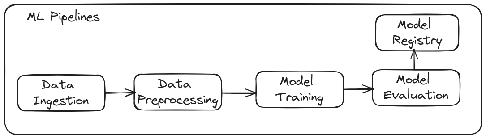
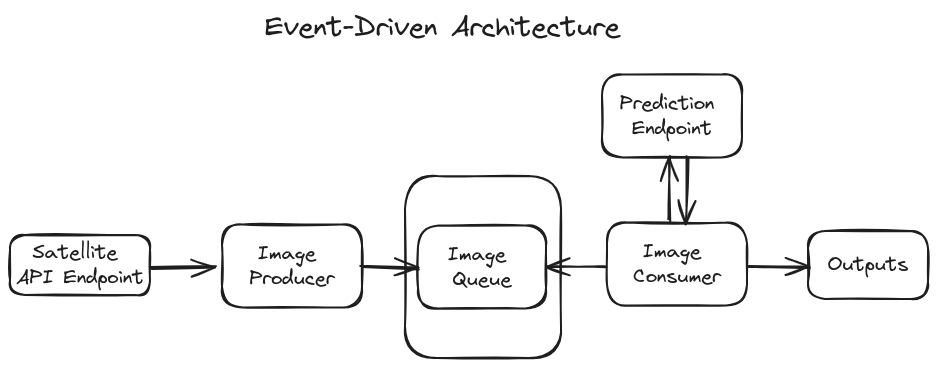

# Airbus-Ship-Detection


[![Contributors][contributors-shield]][contributors-url]
[![Forks][forks-shield]][forks-url]
[![Stargazers][stars-shield]][stars-url]
[![Issues][issues-shield]][issues-url]
[![MIT License][license-shield]][license-url]
[![LinkedIn][linkedin-shield]][linkedin-url]

## Table of Contents
- [Project Overview](#project-overview)
- [Architecture](#architecture)
- [Getting Started](#getting-started)
- [Licence](#license)
- [Contact](#contact)


<!-- ABOUT THE PROJECT -->
## Project Overview
The aims of this project is to detect ships from satellite images using an event-driven architecture. The project implements an End-to-End U-Net based deep learning model for detecting ships. The model predicts segmentations masevent-driven-architectureks indicating the ships within the images.


## Architecture
The project consists of two main architectures, each containing specific pipelines for different purposes:

- #### Training Pipeline Architecture
For training the model and consists of four components. The components are orchestrated using Airflow:
1. Data Ingestion: Download the datasets from kaggle.
2. Preprocessing: Apply preprocessing techiniques to the datasets.
3. Model Training: Builds and trains the ship detection model.
4. Model Evaluation: Evaluates the performance of the trained model.
<p align="center">
  
</p>

- #### Inference Pipeline 
This architecture is based on an event-driven approach for making predictions using the trained model.
1. Producer: Publishes new satellite images from a Satellite API.
2. Consumer: Consumes the published images and sends a Post request to the prediction API endpoint.
3. API: Handles the prediction requests and returns the results.
<p align="center">
  
</p>


<!-- GETTING STARTED -->
## Getting Started
### 1.Clone the Repository
``` bash
git clone https://github.com/ldebele/Airbus-Ship-Detection.git
cd Airbus-Ship-Detection 
```

 ### 2. Install Docker and Docker Compose
    Follow the instructions on the [Docker website]() to install Docker and Docker Compose.

### 3. Build Docker images
``` bash
make 
```
### 4. Start the pipelines.

 #### - To start the inference pipeline.
``` bash
docker-compose up 
```

- #### To start the training pipeline.
    - Initialize the database
    ``` bash
    docker-compose -f docker-compose.training.yml up airflow-init
    ```
    - Running the airflow
    ```bash
    docker-compose -f docker-compose.training.yml up
    ```

### 5. Accessing the web interfaces.

- #### Airflow Web Interface
    Once the cluster has started up, you can log into the web interface and begin experimenting the pipelines.
    Access the Airflow web interface at [http://localhost:8080](http://localhost:8080) using the defult credentials:
        - Username: `airflow`
        - Password: `airflow`

- #### MLflow Web Interface
    Access the MLflow experiment tracker at [http://localhost:5000](http://localhost:5000)

- #### API Web Server:
    Access the prediction inference API web server at [http://localhost:8585](http://localhost:8585)


### 6. Stop and delete containers
- For the inference 
    ```bash
    docker-compose down --volumes --rmi all
    ```
- For the training pipelines
    ```bash
    docker-compose -f docker-compose.training.yaml down --volumes --rmi all
    ```


<!-- LICENSE -->
## License
This project is licensed under the MIT License. See [LICENSE](./LICENCE) file for more details.
<!-- <p align="right">(<a href="#readme-top">back to top</a>)</p> -->

<!-- CONTACT -->
## Contact
Lemi Debela - lemidebele@gmail.com

Project Link: [https://github.com/ldebele/Airbus-Ship-Detection](https://github.com/ldebele/Airbus-Ship-Detection)

<!-- <p align="right">(<a href="#readme-top">back to top</a>)</p> -->


<!-- MARKDOWN LINKS & IMAGES -->
<!-- https://www.markdownguide.org/basic-syntax/#reference-style-links -->
