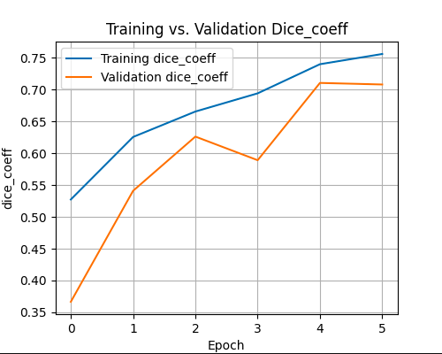
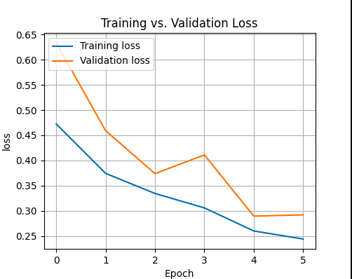

## Datasets
We will use Airbus Ship Detection dataset from Kaggle. The dataset consists more than 250000 images and pixel level annotated masks. You can access the dataset from this [link](https://www.kaggle.com/c/airbus-ship-detection/data)

## Data Preparation
The data preparation process includes the following steps:
1. Convert the masks stored in Run-Length Encoding (RLE) format into binary mask images.
2. The dataset is unbalanced, around 65% of the images contain only background or no ship so drop these images and retain only 1% of them in the dataset.
2. Normalize and Resize the images and masks.
3. Split the data into training and validation sets with an 80:20 ratio.
4. Convert the data into `tf.data.Dataset` format for efficient processing.

## Model Architecture
The U-Net architecture used in this project consists of an encoder (contracting) and decoder (expanding) network structure. The encoder part of the network is a series of convolutional and max-pooling layers that downsample the input images to learn a feature map of the input images, while the decoder part consists of upsampling layers that reconstruct the image to its orginal resolution to accurately identifying the precise location of the object in the image.

## Experimentations
In this project, various experimentation were employed to enhance the performance of the ship detection model. Here are some of the experiments conducted:
- The depth of the U-Net architecture was increased to capture more detailed features, which is crucial for detecting small instances.
- The number of feature maps was increased, starting from 64 and scaling up to 512, to improve the model's ability to learn complex patterns especially in detecting small instances.
- The image size was set to 512x512 to preserve as much detail as possible, which is essential for accurate ship detection.
- I have tried multiple batch size. A larger batch size is recommended to prevent overfitting; however, it requires high computational resources. A batch size of 8 was found to work well with the available GPU.
- The optimal learning rate was determined by fine-tuning with Learning rate scheduler and observe the plotted learning-rate graph to identify a stable learning rate.
- Implemented a kernal initializer to achieve faster convergence and to improved learning.
- The model was trained for a small number of epochs, taking into consideration the available resources and costs.
- Early stopping was implemented to stopped training when the validation loss stopped improving.

## Evaluation
The model's performance is evaluated using metrics such as Dice Coefficient and Dice Coefficient Loss. These metrics measure the overlap between the actual mask and the predicted mask.

- Training vs. Validation Dice Coefficient.

  

- Training vs. Validation Dice Coefficient Loss

  

